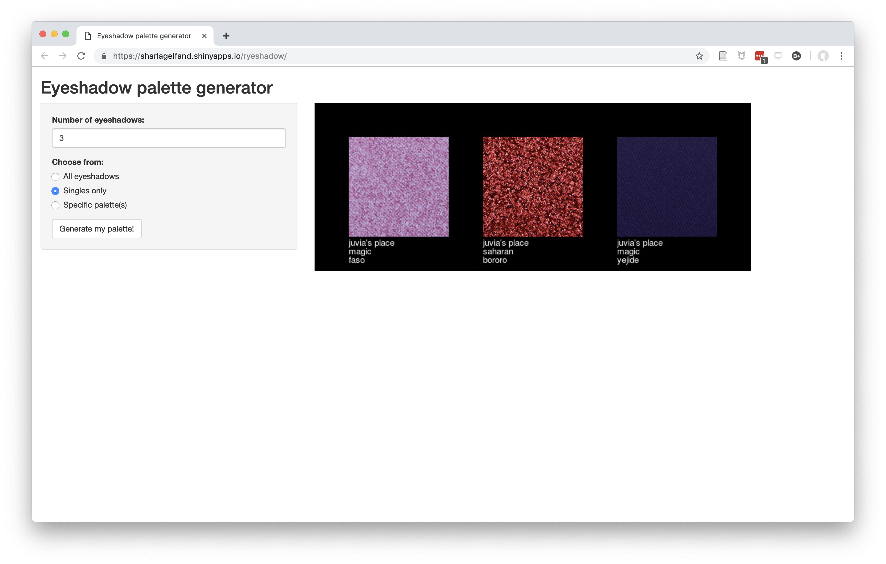

```{r setup, include = FALSE}
## options(htmltools.dir.version = FALSE)
library("knitr")
opts_knit$set(global.par = TRUE)
```

# what is sage bionetworks?

A non-profit research institute working to make science more **open**, **collaborative**, and **inclusive**. 

```{r sage, echo = FALSE}
knitr::include_graphics("images/sage-logo.svg")
```

???
A lot of scientific work tends to be very closed, people don't want to share their data etc.

I joined Sage in part because of the focus on open science

My colleagues are computational biologists, software engineers, designers

---

# my team at sage

Data Coordinating Center for communities researching neurodegenerative and neuropsychiatric diseases

???

We get grants from funding agencies to help other scientists share their data

---

# AMP-AD 
### Accelerating Medicines Partnership - Alzheimer’s Disease

- Identifying potential drug targets for Alzheimer’s disease
- We curate and share data from AMP-AD and related groups

???

- omics data, behavioral, lots of different types, some quite large (especially omics data) — many consist of hundreds or thousands of files that can be multiple gigabytes each

---

# my work at sage

Helping researchers document and share their data

--

Developing standards for metadata to enable cross-project collaboration and sharing

--

Data cleaning and validation

???

you've read the paper I wrote with Karl Broman about how to organize data in spreadsheets. Most of my collaborators have not read this paper, and their data is often messy and lacking important information.

But, they are required to share data by the NIH policies

In addition to helping them do this, we're developing more standardized data formats so that it's easier to reuse data from many different projects

I also clean and validate data that researchers submit. This can be very time consuming and involves writing a lot of custom R scripts to clean up the data and publish it to our data platform.

---
class: center

## Curating a dataset used to take >40 emails


---
background-image: url(images/amp-results.png)

---
background-image: url(images/amp-results-details.png)

---
background-image: url(images/ampadportal.png)
class:urlslide

# https://ampadportal.org

---

# Agora

- Re-analyzed many datasets from the AMP-AD Knowledge Portal to find genes associated with Alzheimer’s disease

- Provides evidence and visualizations to help researchers pick targets to study further

---
background-image: url(images/agora-home.png)
class:urlslide

# https://agora.ampadportal.org

---
background-image: url(images/agora-network.png)

---
class: inverse, middle, center

# I didn't plan to pursue a career with data

---
background-image: url(images/jannes-glas-595351-unsplash.jpg)
background-position: center
background-color: #453050


---
# a path into data science

- BS in environmental science with a little stats

--
  - I was afraid of math

--
- Data manager for Siberian plankton 

---
background-image: url(images/baikal.jpg)
background-position: 0, 0

???

A little about the baikal project and data
3 generations of a single family of Siberian scientists collected data starting in the 1940s
I cleaned this data and prepped it for analyses, helped guide researchers on data best practices, etc.


---
class: inverse, middle, center

# R is cool, actually `r emo::ji("sunglasses")`

---
background-image: url(images/accidental-art.png)
class:urlslide

# http://accidental-art.tumblr.com/

???

Started getting more involved in the R community on Twitter and experimenting with things on my own, which sometimes led to unexpected results

---
# a path into data science

- BS in environmental science with a little stats
  - I was afraid of math
- Data manager for Siberian plankton

--
- Master's in library and information science

--
- Intern on ggplot2

???

- I enjoyed working with data and decided to go back for my MLIS
- Took classes in data curation, data science, data visualization
- From having been involved with the R community, after I graduated I got offered an internship working on ggplot2 with Hadley Wickham
- Fixed bugs, added some new features to ggplot2

---
class: inverse, middle, center

# You can learn a lot from silly projects

---
background-image: url(images/gas-mileage.png)


???

I know how to write shiny apps to do data validation because I first wrote one to track my car's gas mileage

---

# ggbarf

```{r ggbarf, warning = FALSE, message = FALSE, fig.height = 4}
library("ggbarf")
set.seed(123)
dat <- data.frame(x = sample(letters[1:3], 6, replace = TRUE))

ggplot(dat, aes(x)) +
  geom_barf()
```


???

I wrote this because I accidentally typed geom_barf() instead of geom_bar() once

---

# LaCroixColoR

```{r lacroix, eval = FALSE}
library("LaCroixColoR")
lacroix_palette("Pamplemousse", type = "discrete")
```

```{r lacroix-show, out.width = 400, echo = FALSE}
knitr::include_graphics("https://github.com/johannesbjork/LaCroixColoR/blob/master/example_images/Pamplemousse_discrete.jpg?raw=true")
```


---

# BRRR: Let Gucci Mane tell you when your script is done.

```{r save-audio-snippet, echo = FALSE}
save_audio_snippet <- function(audio, output_file) {
  writeLines(
    sprintf(
      '<html><body><audio controls><source src="%s"></audio></body></html>',
      audio
    ),
    output_file
  )
}
```


```{r audio-demo-default, eval = FALSE}
library("BRRR")
skrrrahh()
```

```{r play-audio, echo = FALSE}
html1 <- "gucci.html"
save_audio_snippet(
  system.file("adlibs/gucci1.wav", package = "BRRR"), 
  html1
)
htmltools::includeHTML(html1)
```

```{r audio-demo-flava, eval = FALSE}
skrrrahh("flava")
```

```{r play-audio-flava, echo = FALSE}
html2 <- "flava.html"
save_audio_snippet(
  system.file("adlibs/flava.wav", package = "BRRR"), 
  html2
)
htmltools::includeHTML(html2)
```


---

# Eyeshadow palette generator

```{r ryeshadow, echo = FALSE}

```


---

# Catterplots

```{r, echo = FALSE}
par(mar = c(3,3,0,0))
```

```{r catterplots-1, message = FALSE, fig.height = 4.5, fig.width = 4.5, results = "hide"}
library("CatterPlots")
x <- -10:10
multicat(x, rnorm(21), cat = 1:10, canvas = c(-0.1,1.1, -0.1, 1.1))
```


---

# Catterplots


```{r catterplots-2, message = FALSE, fig.height = 4.5, results = "hide"}
x <- -10:10
y <- -x^2 + 10
rainbowCats(x, y, ptsize = 2, catshiftx = 0.5, catshifty = -0.2)
```


---
class: inverse, middle, center

# The best part about R is the community

---
class: middle, center

<blockquote class="twitter-tweet" data-lang="en"><p lang="en" dir="ltr">Ok <a href="https://twitter.com/hashtag/rstats?src=hash&amp;ref_src=twsrc%5Etfw">#rstats</a> folks, what are your favorite funny, silly, lighthearted R projects?</p>&mdash; Kara Woo (@kara_woo) <a href="https://twitter.com/kara_woo/status/1100908125396193281?ref_src=twsrc%5Etfw">February 27, 2019</a></blockquote>
<script async src="https://platform.twitter.com/widgets.js" charset="utf-8"></script>

---
class: inverse

# to sum up

- There are many paths into data science

--
- There are many careers that use data science skills

--
- Data science is creative

--
- R has a great and encouraging community 
